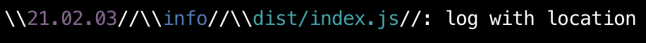

# Colorized Logger

This is colorized logger built as a wrapper for winston with easy usage. 
You can set any colors you want and customize fields you want to see in logs.
Compatible with TypeScript
Uses `ANSI escape codes` for work with colors 

## Installation

```
$ npm i colorized-logger
```

## Usage
use import syntax
```ts
    import { ColorizedLogger, Level } from 'colorized-logger';

    const logger = new ColorizedLogger(Level.debug);
```
or require
```js
    const { ColorizedLogger } = require('colorized-logger');

    const logger = new ColorizedLogger('debug');
```
## Methods and Examples 

method:
```ts
    logger.info('string', 1, [1, 2], [{ key: [NaN] }], { [1]: true }, undefined, NaN, true, Infinity, false);
```
result:


methods:
```ts
    logger.info('log with default settings');
    logger.debug('debug');
    logger.warn('warn');
    logger.error('error');
```
result:


By default logger has `YYYY.MM.DD HH:mm:ss:SSS` timestamp format, but you can use our own
method:
```ts
    logger.setTimeStampFormat('YY.MM.DD');
```
result:


Set braces for different elements in logs. 
1 arg - left brace
2 arg - second brace
method:
```ts
    logger.setBracesType({ timestamp: [' ', ' '], level: ['{', '}'] });
```
result:


Set braces for all elements. 
1 arg - left brace
2 arg - second brace
method:
```ts
    logger.setBracesTypeForAll(['\\\\', '//']);
```
result:


Set context of log message. By default ot doesnt exists in logger
method:
```ts
    logger.setLocation('dist/index.js');
```
result:



method:
reset all braces to default []
```ts
    logger.resetBraces();
```
result:


Use `ANSI escape code` for setup the color you like
method:
```ts
    logger.setColors({ timestampColor: '\u001b[42m' });
```
result:


Configure elements in logs you want to see
method:
```ts
    logger.setShowOptions({ timestamp: false, level: false });
```
result:


to reset location just set empty sring
method:
```ts
    logger.setLocation('');
```
result:


method:
```ts
    logger.setColors({ message: '\u001b[43;1m' });
```
result:

